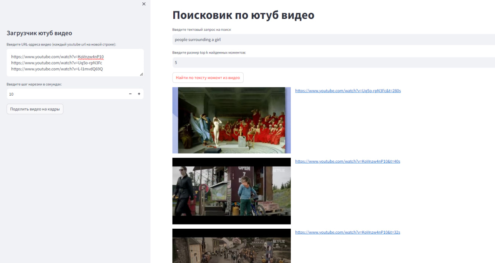

# YouTube_searcher
Youtube video moment searcher by text or photo




---

## __Локальная установка:__

### __Используя Python:__
Необходимо иметь установленный python 3.10 или более новой версии. \
Данные команды требуется запускать последовательно в терминале:
1. Склонируйте к себе этот репозиторий 

2. Перейдите с помощью команды cd в созданную папку get_VECG_web

3. Загрузите все необходимые библиотеки:
```
pip install --upgrade --force-reinstall "git+https://github.com/ytdl-org/youtube-dl.git"
pip install -r requirements.txt
```
4. Запустите streamlit сервер:
```
streamlit run web.py
```
Для запуска веб-приложения надо перейти по адресу http://localhost:8501